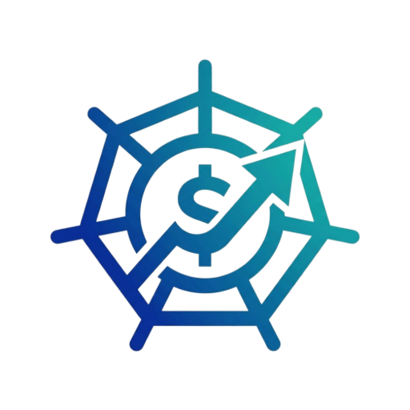
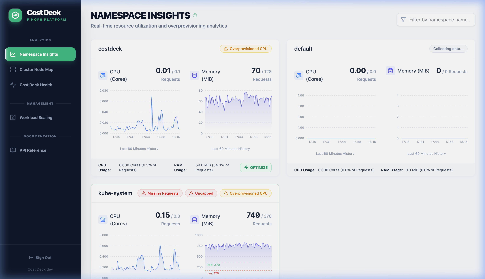
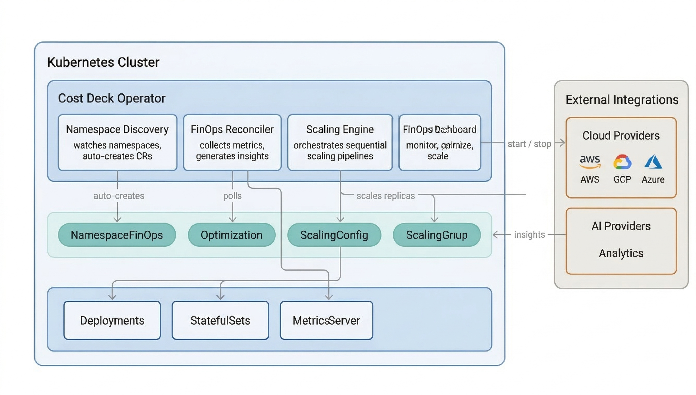

<p align="center">
  
</p>

<h1 align="center">Cost Deck</h1>

<p align="center">
  <strong>Kubernetes FinOps Operator - stop paying for idle infrastructure.</strong>
</p>

<p align="center">
  <a href="https://github.com/migalsp/costdeck/actions/workflows/ci.yml"></a><a href="https://github.com/migalsp/costdeck/releases"></a><a href="https://goreportcard.com/report/github.com/migalsp/costdeck"></a><a href="https://opensource.org/licenses/Apache-2.0"></a><a href="https://codecov.io/gh/migalsp/costdeck"></a>
</p>

<br />

Cost Deck is a lightweight Kubernetes Operator that **finds waste**, **right‑sizes workloads**, and **shuts down idle environments** — all from a single dashboard. Attach AWS Aurora clusters to scale cloud databases alongside your pods.



## Features

| | |
|---|---|
| **Namespace Insights** | Real‑time CPU/Memory breakdown per namespace with waste detection badges |
| **One‑Click Optimization** | Right‑size every Deployment and StatefulSet based on actual usage — revert instantly |
| **Scheduled Scaling** | Scale Dev/Staging environments down outside working hours via `ScalingConfig` (single ns) or `ScalingGroup` (multi‑ns) |
| **Sequential Pipelines** | Define namespace stages so databases scale before apps, and apps before ingress |
| **Cloud Database Scaling** | Start/stop AWS Aurora (and more providers coming) as part of your scaling pipeline |
| **Cluster Node Map** | Visual heat map of node utilization across availability zones |
| **Three Config Methods** | UI Dashboard, REST API, or Kubernetes CRDs (GitOps‑friendly) |

## Quick Start

```bash
helm upgrade --install costdeck-operator \
  oci://ghcr.io/migalsp/costdeck/charts/costdeck-operator \
  --version 1.0.0 \
  --namespace costdeck --create-namespace
```

Configure Ingress in your `values.yaml` and open the dashboard. See the [Installation Guide](docs/installation.md) for details.

## Documentation

| Resource | Description |
|---|---|
| [Installation Guide](docs/installation.md) | Prerequisites, Helm install, post‑install verification, values.yaml reference |
| [User Guide](docs/user-guide.md) | Full feature walkthrough — ScalingConfig, ScalingGroup, Optimization, AWS, all 3 config methods |

## Architecture



## License

[Apache 2.0](LICENSE)

---

<p align="center">If Cost Deck saves you money, please <strong>⭐ star this repository</strong>.</p>