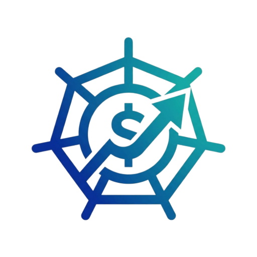
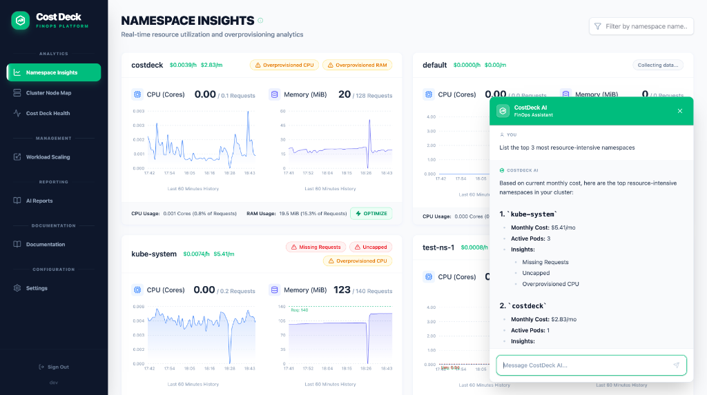
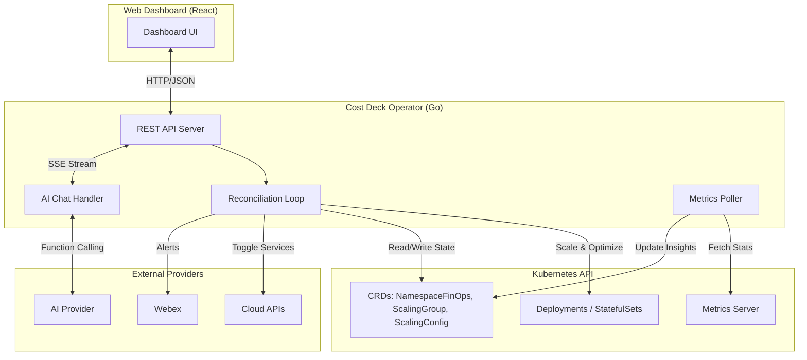

<p align="center">
  
</p>

<h1 align="center">Cost Deck</h1>

<p align="center">
  <strong>Kubernetes FinOps Operator - stop paying for idle infrastructure.</strong>
</p>

<p align="center">
  <a href="https://github.com/migalsp/costdeck/actions/workflows/ci.yml"></a>
  <a href="https://github.com/migalsp/costdeck/releases"></a>
  <a href="https://opensource.org/licenses/Apache-2.0"></a>
</p>

<br />

Cost Deck is a lightweight Kubernetes Operator that **finds waste**, **right-sizes workloads**, and **shuts down idle environments** - all from a single dashboard.



## Features

- **Namespace Insights**: Real-time CPU/Memory breakdown with waste detection.
- **One-Click Optimization**: Right-size Deployments and StatefulSets based on actual usage.
- **Scheduled Scaling**: Scale Dev/Staging environments down outside working hours.
- **Sequential Pipelines**: Define stages to scale databases before apps, and apps before ingress.
- **Cloud Scaling**: Start/stop cloud services (AWS, GCP, Azure) as part of scaling pipelines.
- **Cluster Node Map**: Visual heat map of node utilization across availability zones.
- **AI FinOps Assistant**: Ask questions and trigger optimizations directly from the UI.

## Quick Start

Deploy via Helm:

```bash
helm upgrade --install costdeck-operator \
  oci://ghcr.io/migalsp/costdeck/charts/costdeck-operator \
  --version 1.0.0 \
  --namespace costdeck --create-namespace
```

Configure Ingress in your `values.yaml` and open the dashboard. See the [Installation Guide](docs/installation.md) for details.

## Architecture


```mermaid
graph TD
    subgraph UI["Web Dashboard (React)"]
        A[Dashboard UI]
    end

    subgraph Operator["Cost Deck Operator (Go)"]
        B[REST API Server]
        C[Reconciliation Loop]
        D[AI Chat Handler]
        E[Metrics Poller]
    end

    subgraph K8s["Kubernetes API"]
        F[Metrics Server]
        G[Deployments / StatefulSets]
        H[CRDs: NamespaceFinOps, ScalingGroup, ScalingConfig]
    end

    subgraph Cloud["External Providers"]
        I[AI Provider]
        J[Cloud APIs]
        K[Webex]
    end

    A <-->|HTTP/JSON| B
    B --> C
    B <-->|SSE Stream| D
    
    C -->|Scale & Optimize| G
    C -->|Read/Write State| H
    C -->|Toggle Services| J
    C -->|Alerts| K
    
    D <-->|Function Calling| I
    E -->|Fetch Stats| F
    E -->|Update Insights| H
```

## License

[Apache 2.0](LICENSE)