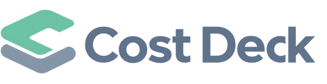
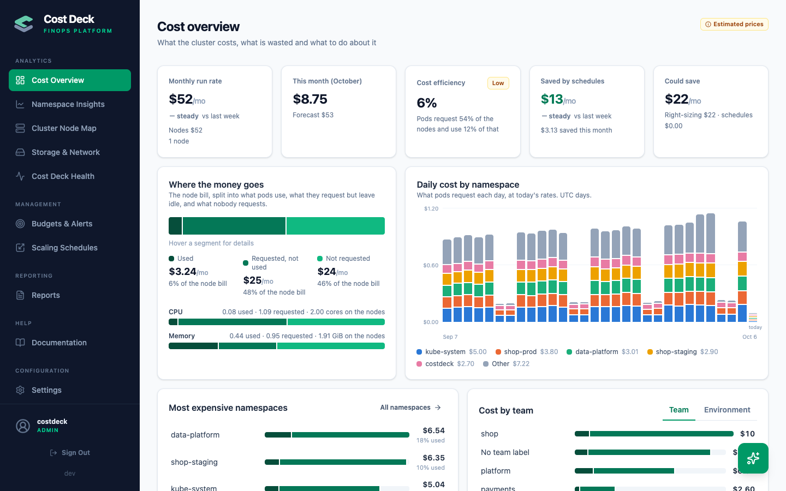
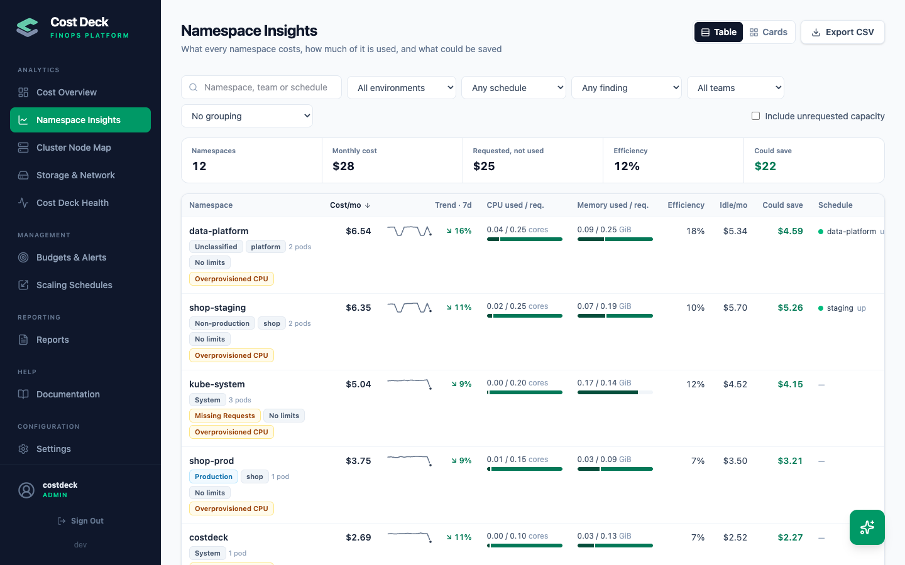
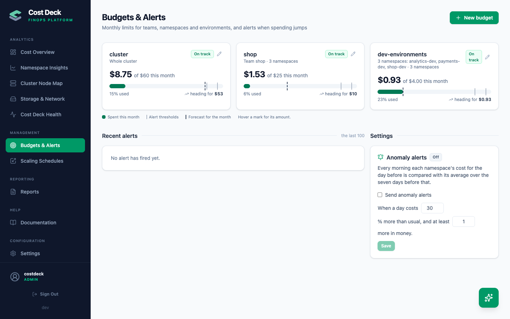
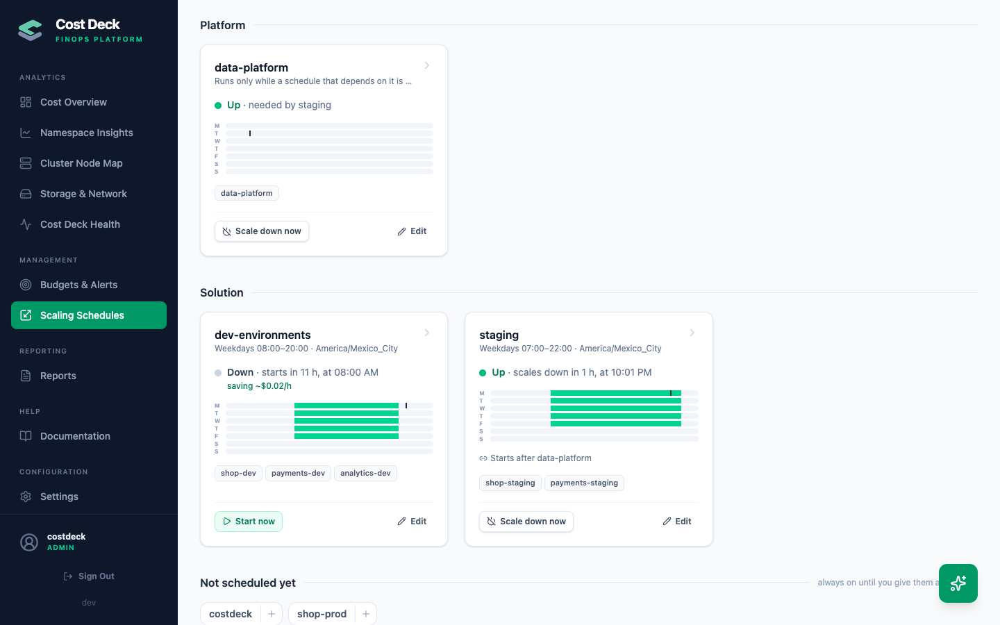
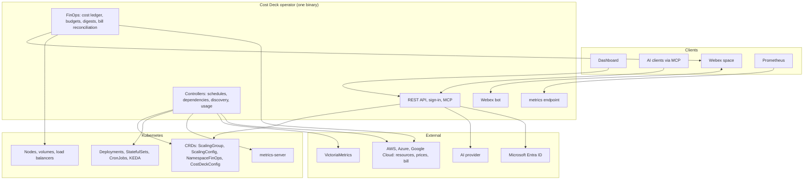

<p align="center">
  
</p>

<p align="center">
  <strong>Kubernetes FinOps operator: see what every namespace costs, and stop paying for idle infrastructure.</strong>
</p>

<p align="center">
  <a href="https://github.com/migalsp/costdeck/actions/workflows/ci.yml"></a>
  <a href="https://github.com/migalsp/costdeck/releases"></a>
  <a href="https://opensource.org/licenses/Apache-2.0"></a>
</p>

<br />

Cost Deck runs in your cluster. It shows what the cluster and each namespace cost and
waste, sets budgets that warn you before the month runs over, advises on requests and node
shapes, and scales non-production environments to zero when nobody needs them, then brings
them back on time. There is no external service: one operator in your cluster does it all.



<table>
  <tr>
    <td width="33%" valign="top"><br><sub><b>Namespace Insights</b>: cost, usage, trend and what could be saved, per namespace</sub></td>
    <td width="33%" valign="top"><br><sub><b>Budgets &amp; Alerts</b>: monthly limits per team, environment or set of namespaces</sub></td>
    <td width="33%" valign="top"><br><sub><b>Scaling Schedules</b>: environments on working hours, platforms on demand</sub></td>
  </tr>
</table>

## Features

### See the cost

- **Cost overview.** The node bill split into what pods use, what they request but leave
  idle, and what nobody requests; the month to date with a forecast; week-over-week
  changes; cost by team and environment; and the savings opportunities, ranked.
- **Namespace Insights.** Every namespace with its cost, usage, efficiency, trend and
  findings, filtered by environment, team, schedule or finding, and exported as CSV.
- **Storage, network and the real bill.** Persistent volumes and load balancers are priced
  and charged to their namespace, and unused volumes and idle load balancers are found.
  Costs can be reconciled with the AWS, Azure or Google Cloud bill, so discounts,
  reservations, savings plans and spot prices show in every figure.
- **Prices you can check.** AWS and Azure list prices per instance type, your own rates,
  or an estimate in line with cloud list prices. Every figure says which basis it uses.

### Act on it

- **Scaling schedules.** Pick namespaces and when they should run: working hours, the work
  week non-stop, or any custom windows, in any time zone. Outside those hours workloads go
  to zero; their replica counts are restored afterwards.
- **Shared platforms on demand.** A schedule can depend on another one. An on-demand
  platform (databases, Kafka, logging) starts only while an environment that needs it is
  up, and environments wait until it is fully up.
- **Overrides that end on their own.** "Start now" or "Scale down now" holds until the next
  scheduled change, or for a time you choose, then the schedule takes over again.
- **Cloud resources too.** Namespaces start stage by stage and stop in reverse, and the
  stages can include AWS Aurora and EC2, Azure VMs and PostgreSQL/MySQL flexible servers,
  and Google Cloud Compute Engine and Cloud SQL. CronJobs are suspended and KEDA
  ScaledObjects paused while a namespace is down.
- **Right-sizing and node advice.** Read-only advice on which requests can shrink (p95
  usage when VictoriaMetrics is connected), and per node pool the instance type and count
  that fit the requests, arm64 alternatives and spot capacity for non-production
  workloads. Cost Deck never edits your requests or nodes.
- **Budgets and alerts.** Monthly budgets per cluster, team, environment or any set of
  namespaces, alerting at thresholds and when the month is heading over; daily cost
  anomaly alerts; and a weekly or monthly cost digest, all posted to Webex.

### Fits your team

- **Access.** Local users with viewer, operator and admin roles, Microsoft Entra ID single
  sign-on with group-to-role mapping, API tokens, and least-privilege RBAC: Secrets are
  only read in the operator's own namespace.
- **Where you already work.** A Webex bot, an AI assistant (Claude, OpenAI-compatible or
  Gemini) that proposes actions for you to confirm, an MCP server for AI clients, and
  Prometheus metrics.

## Quick start

```bash
helm upgrade --install costdeck-operator \
  oci://ghcr.io/migalsp/costdeck/charts/costdeck-operator \
  --version <version> --namespace costdeck --create-namespace

kubectl get secret costdeck-operator-admin-credentials -n costdeck \
  -o jsonpath='{.data.password}' | base64 -d; echo
kubectl port-forward -n costdeck svc/costdeck-operator-api 8082:8082
```

Open http://localhost:8082 and sign in as `costdeck`. Pick the latest version from
the [releases](https://github.com/migalsp/costdeck/releases). The
[installation guide](docs/installation.md) covers Ingress, SSO, cloud accounts, monitoring
and every chart value.

## Documentation

- **In the dashboard**: the **Documentation** page has step-by-step guides (schedules,
  cloud resources, cost and right-sizing, access, AI, Webex, troubleshooting) and a REST API
  reference generated from the live OpenAPI document.
- **[Installation guide](docs/installation.md)**: chart values, Ingress, single sign-on,
  cloud permissions, monitoring, upgrades.
- **API**: Swagger UI at `/api/docs`, the specification at `/api/openapi.yaml` and
  `/api/openapi.json`. Every operation names the role it needs.

## How it fits together


```mermaid
graph TD
    subgraph Clients
        UI[Dashboard]
        AI[AI clients via MCP]
        WX[Webex space]
        PR[Prometheus]
    end

    subgraph Operator["Cost Deck operator (one binary)"]
        API[REST API, sign-in, MCP]
        CTRL[Controllers: schedules, dependencies, discovery, usage]
        FIN[FinOps: cost ledger, budgets, digests, bill reconciliation]
        BOT[Webex bot]
        MET[metrics endpoint]
    end

    subgraph Cluster["Kubernetes"]
        CRD[CRDs: ScalingGroup, ScalingConfig, NamespaceFinOps, CostDeckConfig]
        WL[Deployments, StatefulSets, CronJobs, KEDA]
        INF[Nodes, volumes, load balancers]
        MS[metrics-server]
    end

    subgraph External
        VM[VictoriaMetrics]
        CLOUD[AWS, Azure, Google Cloud: resources, prices, bill]
        LLM[AI provider]
        ENTRA[Microsoft Entra ID]
    end

    UI --> API
    AI --> API
    WX <--> BOT
    FIN --> WX
    PR --> MET
    API --> CRD
    CTRL --> CRD
    CTRL --> WL
    CTRL --> MS
    CTRL --> VM
    CTRL --> CLOUD
    FIN --> INF
    FIN --> CLOUD
    API --> LLM
    API --> ENTRA
```

## Development

```bash
make test        # unit and envtest tests
make lint        # golangci-lint
make ui-lint     # TypeScript and ESLint
make ui build    # dashboard + manager binary with the dashboard embedded
make test-e2e    # Kind cluster + Helm install + the regression scenarios in hack/e2e
```

The end-to-end suite runs in CI on every pull request. Every scenario in `hack/e2e`
covers behaviour users depend on (scheduling, dependencies, stage timeouts, workload
rules, auth, API, VictoriaMetrics history, MCP), so a change that breaks one fails the
build. A feature or fix that changes behaviour adds or extends a scenario. To run it
against an existing test cluster instead of a new Kind cluster:

```bash
SKIP_INSTALL=1 ./hack/e2e-smoke.sh                 # skips the settings-changing scenarios
SKIP_INSTALL=1 DISPOSABLE=1 E2E_ONLY='30|40' ./hack/e2e-smoke.sh
```

## License

[Apache 2.0](LICENSE)
