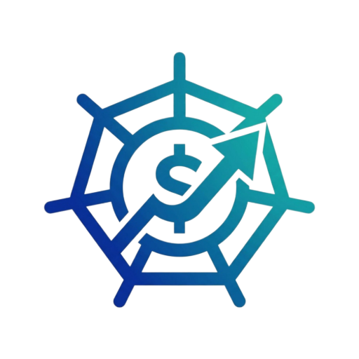
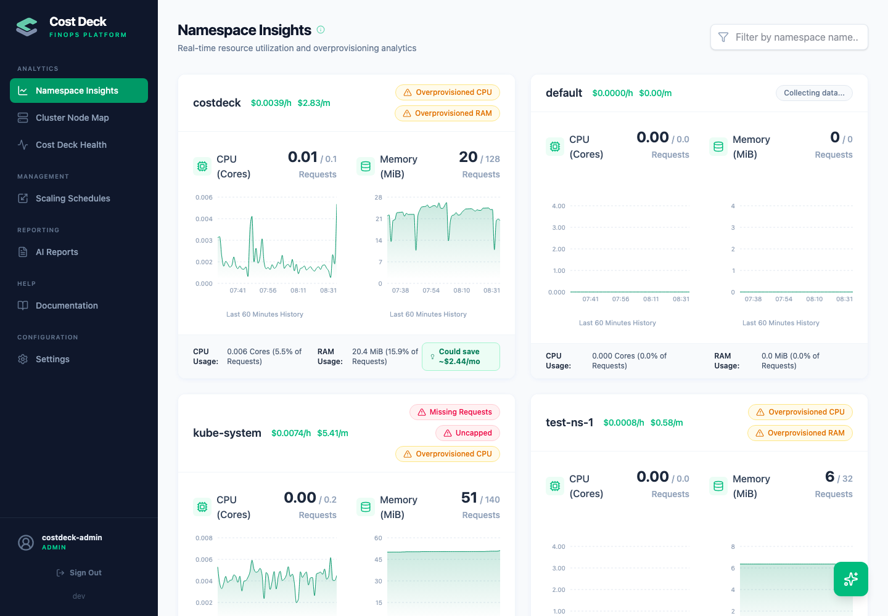
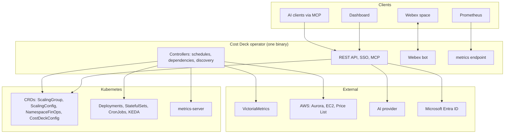

<p align="center">
  
</p>

<h1 align="center">Cost Deck</h1>

<p align="center">
  <strong>Kubernetes FinOps operator: stop paying for idle infrastructure.</strong>
</p>

<p align="center">
  <a href="https://github.com/migalsp/costdeck/actions/workflows/ci.yml"></a>
  <a href="https://github.com/migalsp/costdeck/releases"></a>
  <a href="https://opensource.org/licenses/Apache-2.0"></a>
</p>

<br />

Cost Deck runs in your cluster, shows what each namespace costs and wastes, and scales
non-production environments to zero when nobody needs them, then brings them back on time.



## Features

- **Scaling schedules.** Pick namespaces and when they should run: working hours, the work
  week non-stop, or any custom windows, in any time zone. Outside those hours workloads go
  to zero; their replica counts are restored afterwards.
- **Shared platforms on demand.** A schedule can depend on another one. An on-demand
  platform (databases, Kafka, logging) starts only while an environment that needs it is
  up, and environments wait until it is fully up.
- **Overrides that end on their own.** "Start now" or "Scale down now" holds until the next
  scheduled change, or for a time you choose, then the schedule takes over again.
- **Ordered start and stop.** Namespaces start stage by stage and stop in reverse. AWS
  Aurora clusters and EC2 instances can be part of the sequence. CronJobs are suspended
  and KEDA ScaledObjects paused while a namespace is down.
- **Cost and right-sizing.** Per-namespace cost from AWS list prices or your own rates,
  live savings, and read-only advice on which requests can shrink, based on p95 usage when
  VictoriaMetrics is connected. Cost Deck never edits your requests.
- **Built for teams.** Microsoft Entra ID single sign-on with group-to-role mapping
  (viewer / operator / admin), API tokens, and least-privilege RBAC: Secrets are only read
  in the operator's own namespace.
- **Where you already work.** A Webex bot that answers commands and announces finished
  scaling, an AI assistant (Claude, OpenAI-compatible or Gemini), an MCP server for AI
  clients, and Prometheus metrics.

## Quick start

```bash
helm upgrade --install costdeck-operator \
  oci://ghcr.io/migalsp/costdeck/charts/costdeck-operator \
  --version <version> --namespace costdeck --create-namespace

kubectl get secret costdeck-operator-admin-credentials -n costdeck \
  -o jsonpath='{.data.password}' | base64 -d; echo
kubectl port-forward -n costdeck svc/costdeck-operator-api 8082:8082
```

Open http://localhost:8082 and sign in as `costdeck-admin`. Pick the latest version from
the [releases](https://github.com/migalsp/costdeck/releases). The
[installation guide](docs/installation.md) covers Ingress, SSO, cloud accounts, monitoring
and every chart value.

## How it fits together


```mermaid
graph TD
    subgraph Clients
        UI[Dashboard]
        AI[AI clients via MCP]
        WX[Webex space]
        PR[Prometheus]
    end

    subgraph Operator["Cost Deck operator (one binary)"]
        API[REST API, SSO, MCP]
        CTRL[Controllers: schedules, dependencies, discovery]
        BOT[Webex bot]
        MET[metrics endpoint]
    end

    subgraph Cluster["Kubernetes"]
        CRD[CRDs: ScalingGroup, ScalingConfig, NamespaceFinOps, CostDeckConfig]
        WL[Deployments, StatefulSets, CronJobs, KEDA]
        MS[metrics-server]
    end

    subgraph External
        VM[VictoriaMetrics]
        AWS[AWS: Aurora, EC2, Price List]
        LLM[AI provider]
        ENTRA[Microsoft Entra ID]
    end

    UI --> API
    AI --> API
    WX <--> BOT
    PR --> MET
    API --> CRD
    CTRL --> CRD
    CTRL --> WL
    CTRL --> AWS
    CTRL --> MS
    CTRL --> VM
    API --> LLM
    API --> ENTRA
```

## Development

```bash
make test        # unit and envtest tests
make lint        # golangci-lint
make ui-lint     # TypeScript and ESLint
make ui build    # dashboard + manager binary with the dashboard embedded
make test-e2e    # Kind cluster + Helm install + hack/e2e-smoke.sh
```

## License

[Apache 2.0](LICENSE)
