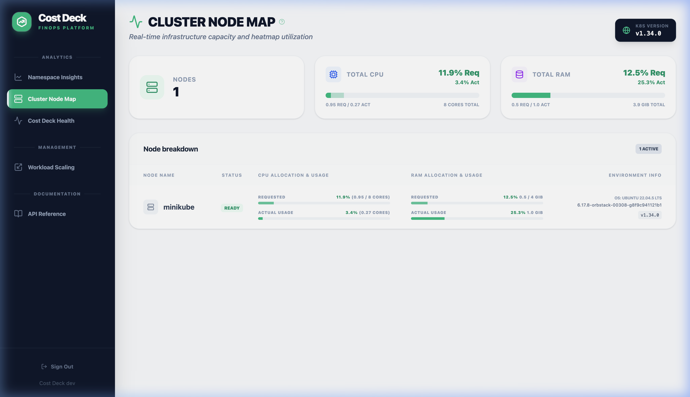
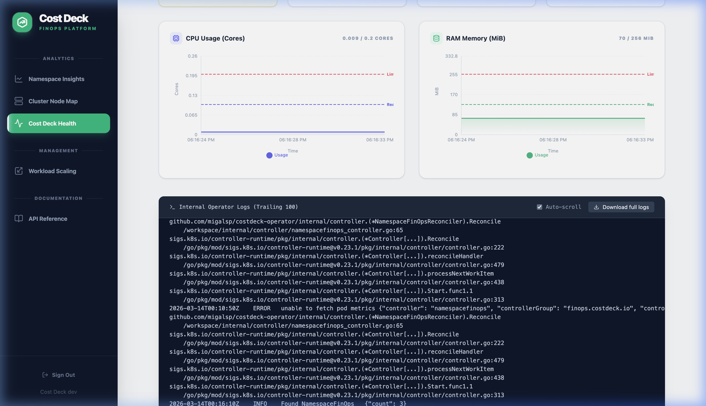
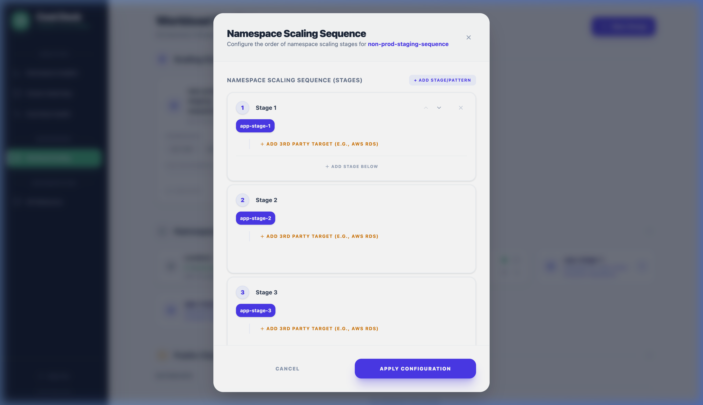
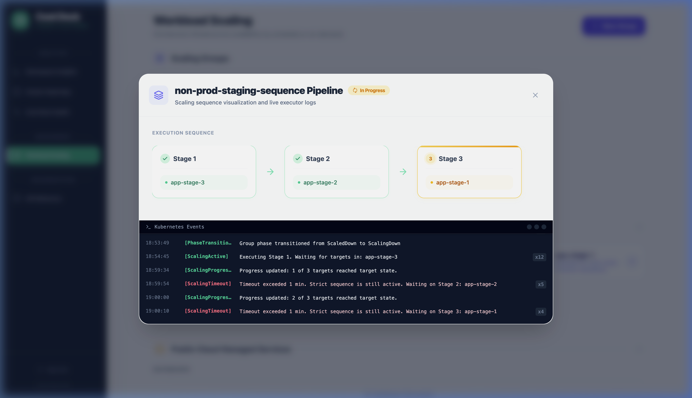

# Cost Deck User Guide

Cost Deck is a Kubernetes-native FinOps and Orchestration platform designed to provide full visibility into your cluster costs and automate infrastructure savings without affecting production reliability.

---

## 1. Namespace Insights
The **Namespace Insights** view provides a high-level cost breakdown for every namespace in your cluster. It helps you identify "cost-heavy" projects and automatically detects resource over-provisioning.

### Key Features:
- **Cost Allocation**: See exactly which team or project is driving cluster spend.
- **Waste Detection**: Identification of services with high CPU/Memory requests but low actual usage.
- **Right-sizing Recommendations**: Suggested values for your resource limits to optimize performance and cost.


*Use the analytics dashboard to monitor daily spend and resource efficiency across all namespaces.*

---

## 2. Cluster Node Map
The **Cluster Node Map** offers a real-time heat map of your physical infrastructure. 

### Why use it?
- **Hotspots**: Quickly identify nodes that are running at >90% capacity.
- **Fragmentation**: See if your cluster has many under-utilized nodes that can be consolidated to save money.
- **Topology Awareness**: Visualize where your critical workloads are physically running.


*The Node Map provides a visual representation of cluster health and capacity utilization.*

---

## 3. Cost Deck Health
Transparency is key. The **Cost Deck Health** dashboard allows you to monitor the internal state of the Cost Deck operator itself.

### What's Monitored:
- **Operator Performance**: CPU/Memory usage of the Cost Deck controllers.
- **Live Logs**: Stream real-time events from the operator to debug scaling sequences or detection logic.
- **Reconciliation Status**: Verify that the operator is successfully communicating with the Kubernetes API.


*Check the health status and internal logs to ensure continuous cost management.*

---

## 4. Workload Scaling (Deep Dive)
Cost Deck's core engine allows you to orchestrate workload availability based on schedules and dependencies.

### Core Concepts

#### Sequential Scaling (Stages)
Cost Deck organizes namespaces into **Stages**. When a "Scale Down" is triggered:
- **Stage 3** (Edge/Ingress) scales down first.
- **Stage 2** (App) follows once Stage 3 is ready.
- **Stage 1** (DB/Core) scales can down last.
*Scale Up follows the exact reverse order.*

#### Dependency Awareness
By grouping namespaces into stages, you prevent "orphan" requests and database connection errors during transition periods.

### Configuration Methods

#### Method A: Configuration via UI
The interactive dashboard provides the best experience for visualizing your infrastructure topology.

1. Navigate to **Workload Scaling** in the sidebar.
2. Click **+ New Group**.
3. Name your group (e.g., `non-prod-staging`).
4. **Define Stages**: Add namespaces to specific stages to set the scaling order.


*Configuring sequential stages in the UI to manage namespace dependencies.*

#### Method B: Configuration via API
Perfect for triggering scaling from CI/CD pipelines (e.g., scale up a namespace before running E2E tests).

```bash
curl -i -X POST http://costdeck-api/api/v1/scaling-groups/staging/scale-down \
  -H "Authorization: Bearer $CD_TOKEN"
```

#### Method C: Configuration via CRD (GitOps)
Define your scaling logic as code for maximum reproducibility.

```yaml
apiVersion: costdeck.io/v1alpha1
kind: ScalingGroup
metadata:
  name: non-prod-sequence
spec:
  schedule:
    activeHours: "09:00-18:00"
    daysOfWeek: ["Mon", "Tue", "Wed", "Thu", "Fri"]
  stages:
    - name: "Database"
      namespaces: ["app-db"]
    - name: "Application"
      namespaces: ["app-v1", "app-v2"]
  autoScaling: true
```

### Monitoring Pipelines
When a scaling action is triggered, you can monitor its progress in real-time.


*The detailed pipeline view shows the status of each individual stage and live events.*

---

## Best Practices

1. **Use Health Checks**: Ensure your applications have robust `readinessProbes` so Cost Deck knows exactly when a stage has completed its transition.
2. **Naming Conventions**: Use descriptive stage names (e.g., "Persistence", "Processing", "Routing") to make the pipeline visualization easier to read.
3. **Dry Run First**: When creating a new complex sequence, enable `dryRun: true` in the CRD to verify the logic in the logs before affecting actual workloads.
