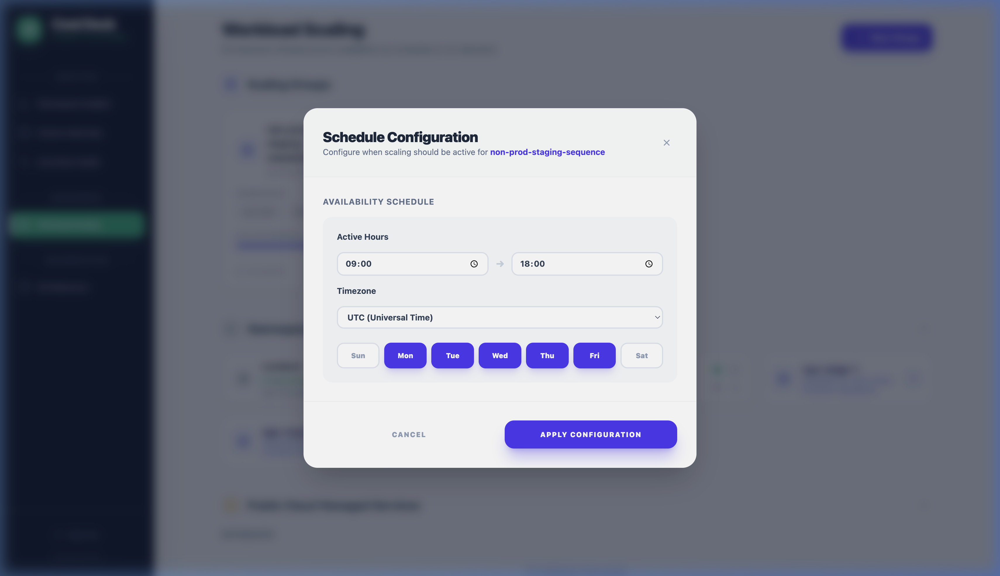
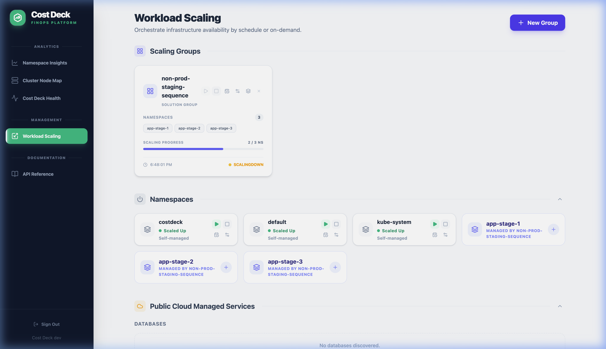
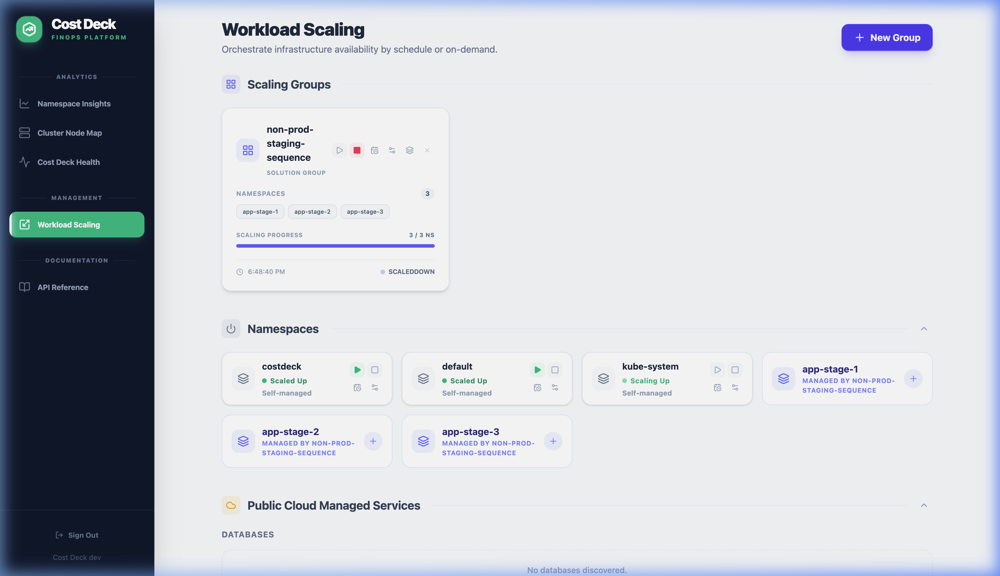

# Cost Deck User Guide

Cost Deck is a Kubernetes-native FinOps and Orchestration platform designed to provide full visibility into your cluster costs and automate infrastructure savings without affecting production reliability.

---

## 1. Namespace Insights

The **Namespace Insights** view provides a real-time cost breakdown for every namespace in your cluster. It helps you identify "cost-heavy" projects and automatically detects resource over-provisioning.

### Key Features

- **Cost Allocation**: See exactly which team or project is driving cluster spend. The UI breaks down costs by CPU, Memory, and Cloud Provider egress.
- **Waste Detection**: Automated identification of services with high CPU/Memory requests but low actual usage. Look for the "Overprovisioned" badges in the namespace list.
- **Right-sizing Recommendations**: Suggested values for your resource limits calculated from the 95th percentile of actual usage over the last 7 days.
- **Usage History**: Each namespace maintains a 60-minute rolling history of CPU and Memory metrics (usage, requests, limits) at 1-minute granularity for trend analysis.


*The analytics dashboard: Monitor daily spend and resource efficiency across all namespaces.*

### How It Works

Cost Deck automatically creates a `NamespaceFinOps` Custom Resource for each monitored namespace. This CR stores metric history and generates actionable insights (e.g., "Missing Requests", "High Overprovisioning").

---

## 2. Namespace Optimization

Cost Deck can automatically **right-size** all workloads in a namespace based on their actual resource consumption.

### What It Does

1. Analyzes the current CPU and Memory usage of all Deployments and StatefulSets.
2. Calculates optimized `requests` and `limits` based on real consumption patterns.
3. Applies the new values across all workloads in a single operation.
4. Stores the original values so you can **revert** at any time.

### How to Use

**Via UI:** Navigate to a namespace and click the **Optimize** button. To undo, click **Revert**.

**Via API:**

```bash
# Apply optimization
curl -X POST http://costdeck.internal/api/namespaces/my-app/optimize \
  -H "Cookie: costdeck-session=..."

# Revert to original values
curl -X POST http://costdeck.internal/api/namespaces/my-app/revert \
  -H "Cookie: costdeck-session=..."

# Check optimization status
curl http://costdeck.internal/api/namespaces/my-app/optimization \
  -H "Cookie: costdeck-session=..."
```

---

## 3. Cluster Node Map

The **Cluster Node Map** offers a real-time heat map of your physical infrastructure, organized by node pools or availability zones.

### Why Use It

- **Hotspots**: Quickly identify nodes running at >90% capacity, which might lead to pod evictions.
- **Fragmentation**: See under-utilized nodes that could be consolidated (bin-packing) to save money.
- **Topology Awareness**: Visualize where critical workloads are physically running across AZs to ensure high availability.


*The Node Map: A visual representation of cluster health and capacity utilization.*

---

## 4. Cost Deck Health

The **Cost Deck Health** dashboard lets you monitor the internal state of the Cost Deck operator itself.

### What's Monitored

- **Operator Performance**: Real-time CPU/Memory usage of the operator's controllers.
- **Live Logs**: Stream events from the operator to debug scaling sequences or detection logic directly in the UI.
- **Reconciliation Status**: Verify that the operator is communicating with the Kubernetes API and CRDs are synchronized.


*Monitor the health status and internal logs for continuous cost management.*

---

## 5. Workload Scaling

Cost Deck provides two levels of workload scaling to cover different use cases:

| Feature | ScalingConfig | ScalingGroup |
| :--- | :--- | :--- |
| **Scope** | Single namespace | Multiple namespaces |
| **Use Case** | Fine-grained control per namespace | Orchestrate entire environments |
| **Sequencing** | Resource-level within namespace | Namespace-level across the group |
| **Exclusions** | Exclude specific workloads | — |
| **Cloud Resources** | — | AWS Aurora clusters |
| **CRD** | `ScalingConfig` | `ScalingGroup` |

---

### 5.1 ScalingConfig (Single Namespace)

Use `ScalingConfig` to manage scaling for an **individual namespace**. This is ideal when you want to control one namespace independently, with fine-grained features like resource-level sequencing and workload exclusions.

#### Key Features

- **Schedule-based automation**: Scale namespaces up/down based on time schedules with timezone support.
- **Manual override**: Force a namespace up or down regardless of schedule.
- **Workload sequencing**: Control the order in which Deployments/StatefulSets are scaled within the namespace (e.g., database first, then app).
- **Exclusions**: Protect critical workloads (e.g., monitoring agents) from ever being scaled down.
- **Replica preservation**: Original replica counts are stored and restored during scale-up.

#### Configuration

**Via UI:** Navigate to **Workload Scaling > Configs** and click **+ New Config**.


*Creating a ScalingConfig for a single namespace with schedule and exclusions.*

**Via API:**

```bash
# Create a scaling config
curl -X POST http://costdeck.internal/api/scaling/configs \
  -H "Cookie: costdeck-session=..." \
  -H "Content-Type: application/json" \
  -d '{
    "metadata": {"name": "staging-app"},
    "spec": {
      "targetNamespace": "staging-app",
      "schedules": [{"days": [1,2,3,4,5], "startTime": "09:00", "endTime": "18:00", "timezone": "Europe/Bratislava"}],
      "exclusions": ["monitoring-agent", "log-collector"]
    }
  }'

# Manual override: force scale down
curl -X POST http://costdeck.internal/api/scaling/configs/staging-app/manual \
  -H "Cookie: costdeck-session=..." \
  -d '{"active": false}'
```

**Via CRD (GitOps):**

```yaml
apiVersion: costdeck.io/v1
kind: ScalingConfig
metadata:
  name: staging-app
spec:
  targetNamespace: staging-app
  # active: null → follow schedule; true → force up; false → force down
  schedules:
    - days: [1,2,3,4,5]  # Mon-Fri
      startTime: "09:00"
      endTime: "18:00"
      timezone: "Europe/Bratislava"
  # Sequence controls order: DB scaled first (down) / last (up)
  sequence:
    - "apps/v1:StatefulSet/postgres"
    - "apps/v1:Deployment/*"
  # These workloads will never be scaled to 0
  exclusions:
    - "monitoring-agent"
    - "log-collector"
```

---

### 5.2 ScalingGroup (Multi-Namespace Orchestration)

Use `ScalingGroup` to orchestrate scaling across **multiple namespaces** as a single unit. This is the primary tool for managing entire environments (e.g., "Non-Production", "Staging Platform").

#### Key Features

- **Multi-namespace management**: Group several namespaces under one control plane.
- **Namespace-level sequencing**: Define stages so namespaces scale in a specific order (e.g., DB namespaces first, then app namespaces, then ingress).
- **AWS Cloud Resources**: Attach AWS Aurora clusters as `externalTargets` to start/stop databases alongside your Kubernetes workloads in the same pipeline.
- **Auto-discovery**: When the AWS provider is enabled, Cost Deck can auto-discover Aurora clusters in your account.
- **Pipeline visualization**: Monitor scaling progress in real-time through the UI pipeline view.

#### Configuration

**Via UI:** Navigate to **Workload Scaling > Groups** and click **+ New Group**. Define stages by dragging namespaces into sequential blocks.


*Configuring sequential stages in the UI to manage namespace dependencies.*

**Via API:**

```bash
# Create a scaling group
curl -X POST http://costdeck.internal/api/scaling/groups \
  -H "Cookie: costdeck-session=..." \
  -H "Content-Type: application/json" \
  -d '{
    "metadata": {"name": "non-prod-platform"},
    "spec": {
      "category": "Platform",
      "namespaces": ["postgres-ns", "app-v1", "app-v2", "ingress-ns"],
      "schedules": [{"days": [1,2,3,4,5], "startTime": "09:00", "endTime": "18:00", "timezone": "UTC"}],
      "sequence": ["postgres-ns", "app-v1 app-v2", "ingress-ns"],
      "externalTargets": [{
        "provider": "aws",
        "type": "aurora",
        "identifier": "my-staging-cluster",
        "region": "eu-central-1",
        "executeAfter": "postgres-ns"
      }]
    }
  }'

# Manual override: force scale up
curl -X POST http://costdeck.internal/api/scaling/groups/non-prod-platform/manual \
  -H "Cookie: costdeck-session=..." \
  -d '{"active": true}'
```

**Via CRD (GitOps):**

```yaml
apiVersion: costdeck.io/v1
kind: ScalingGroup
metadata:
  name: non-prod-platform
spec:
  category: Platform
  namespaces:
    - postgres-ns
    - app-v1
    - app-v2
    - ingress-ns
  # active: null → follow schedule; true → force up; false → force down
  schedules:
    - days: [1,2,3,4,5]  # Mon-Fri
      startTime: "09:00"
      endTime: "18:00"
      timezone: "UTC"
  # Sequence: Each element is a "stage". Stages are executed sequentially.
  # Multiple namespaces in one stage (space-separated) scale in parallel.
  # Scale Down: Stage 1 → Stage 2 → Stage 3
  # Scale Up:   Stage 3 → Stage 2 → Stage 1 (reversed)
  sequence:
    - "postgres-ns"          # Stage 1: Database
    - "app-v1 app-v2"        # Stage 2: Application (parallel)
    - "ingress-ns"           # Stage 3: Ingress
  # AWS Aurora clusters to start/stop alongside Kubernetes namespaces
  externalTargets:
    - provider: aws
      type: aurora
      identifier: my-staging-cluster
      region: eu-central-1
      executeAfter: postgres-ns  # Scale this DB after the postgres-ns stage
```

#### Monitoring the Pipeline

When a scaling action is triggered, the UI provides a real-time pipeline visualization showing each stage's progress.


*Starting a scaling operation: The first stage is triggered.*


*Detailed view: Monitoring individual workload progress within a stage.*


*Completion: All stages have reached the target state.*

---

## 6. AWS Cloud Resource Scaling

Cost Deck integrates with **AWS RDS/Aurora** to start and stop database clusters as part of your scaling pipelines. This means you can shut down non-production databases during off-hours alongside your Kubernetes workloads, saving significant cloud spend.

### Supported Resources

| Provider | Type | Actions |
| :--- | :--- | :--- |
| AWS | Aurora Clusters | Start / Stop / Auto-Discover |

### How It Works

1. **Enable the AWS provider** in `values.yaml` (see [Installation Guide](./installation.md)).
2. **Auto-discovery**: Cost Deck automatically discovers all Aurora clusters in the configured region and makes them available for selection in the UI.
3. **Attach to ScalingGroup**: Add the cluster as an `externalTarget` in a ScalingGroup. Use `executeAfter` to control when the database scales relative to your Kubernetes namespaces.
4. **Automatic credentials**: The AWS SDK uses the default credential chain (IRSA, EC2 instance profile, or environment variables).

### Example: Scale Aurora with Kubernetes

```yaml
# In your ScalingGroup spec:
externalTargets:
  - provider: aws
    type: aurora
    identifier: my-staging-aurora
    region: eu-central-1
    executeAfter: database-ns  # Only stop Aurora AFTER the database namespace is down
```

When scaling **down**, the Aurora cluster will be stopped after the specified namespace stage completes. When scaling **up**, the Aurora cluster will be started before that stage begins.

---

## Best Practices

1. **Use readinessProbes**: Ensure your applications have robust `readinessProbes` so Cost Deck knows exactly when a stage has completed its transition.
2. **Naming Conventions**: Use descriptive group names (e.g., `non-prod-staging`, `dev-platform`) and category labels (e.g., `Solution`, `Platform`).
3. **Graceful Shutdown**: Configure `terminationGracePeriodSeconds` for your pods to handle scale-down events without dropping active connections.
4. **Exclude Critical Services**: Use `exclusions` in ScalingConfig to protect monitoring agents, log collectors, and other always-on services from being scaled to zero.
5. **Test Manually First**: Before enabling schedules, use the manual override (`active: true/false`) to verify the scaling behavior in your environment.
6. **Stage Timeouts**: The scaling engine includes a 1-minute timeout per stage. If a stage doesn't reach readiness in time, the pipeline will bypass it and continue to the next stage to prevent deadlocks.
